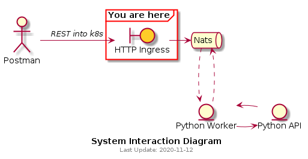

# HTTP Proxy (ingress)

## Summary
Outer proxy entry to system.
Proxy receives a payload via http and publishes onto NATS



## Endpoints
| Endpoint | REST | NATS | Description |
|---|---|---|---|
| /new | POST | foobar | *Passes through to nats channel foobar, which python worker (sleepy worker) picks up*
| /new2 | POST | foobar2 | *python worker calls python API from this route* |

## Payload
```json
{
    "message": "your message",
    "count": 4,
    "id": 0
}
```